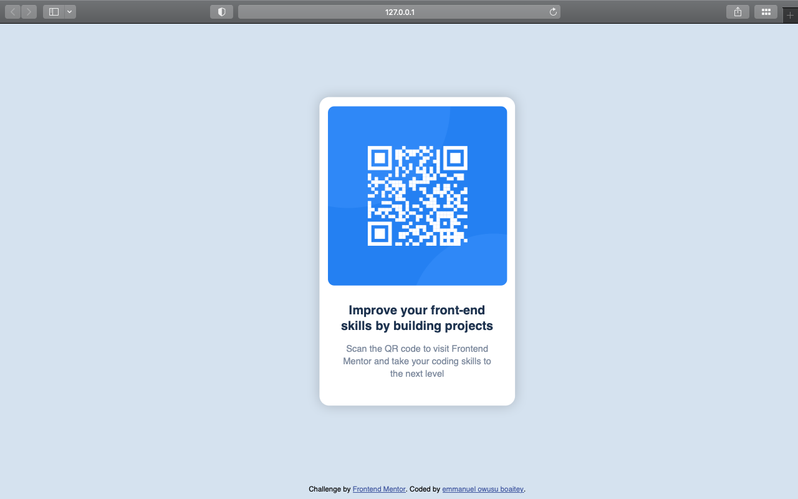

# Frontend Mentor - QR code component solution

This is a solution to the [QR code component challenge on Frontend Mentor](https://www.frontendmentor.io/challenges/qr-code-component-iux_sIO_H). Frontend Mentor challenges help you improve your coding skills by building realistic projects. 

## Table of contents

- [Overview](#overview)
  - [Screenshot](#screenshot)
  - [Links](#links)
- [My process](#my-process)
  - [Built with](#built-with)
- [Author](#author)

## Overview

### Screenshot

- A screenshot of the final output.

### Links

- Solution URL: [github](https://github.com/boaitey1/qr_code_component)
- Live Site URL: [netlify](https://your-live-site-url.com)

## My process

### Built with

- Semantic HTML5 markup
- CSS

## Author

- Frontend Mentor - [@boaitey1](https://www.frontendmentor.io/profile/boaitey1)
